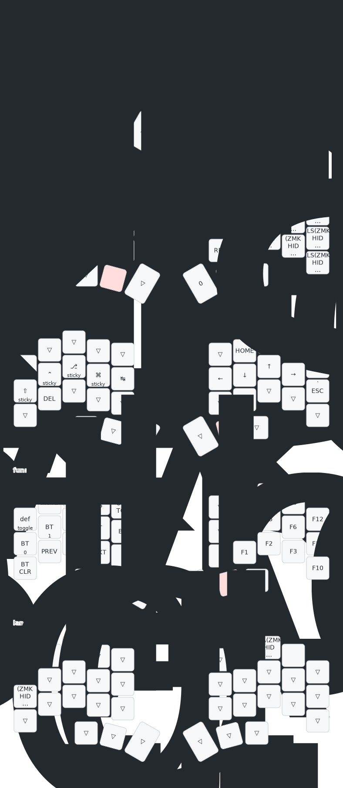

# Temper ZMK Config

This is my personal ZMK config for the [temper](https://github.com/raeedcho/temper),
compatible with [Nickcoutsos keymap editor](https://nickcoutsos.github.io/keymap-editor).

Some notes about this config:
- Four main layers (default, numbers/symbols, navigation, and function)
- Default layer is QWERTY layer 
- Navigation layer has vim-like arrow keys

